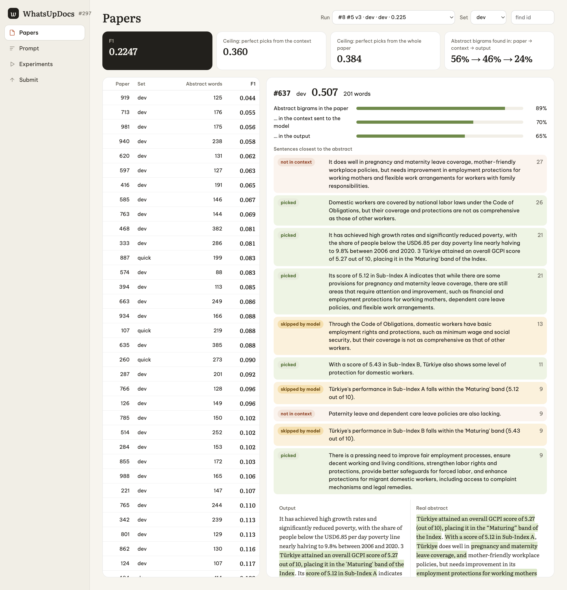
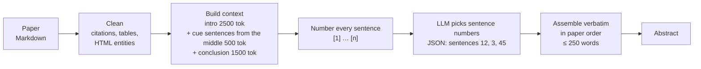
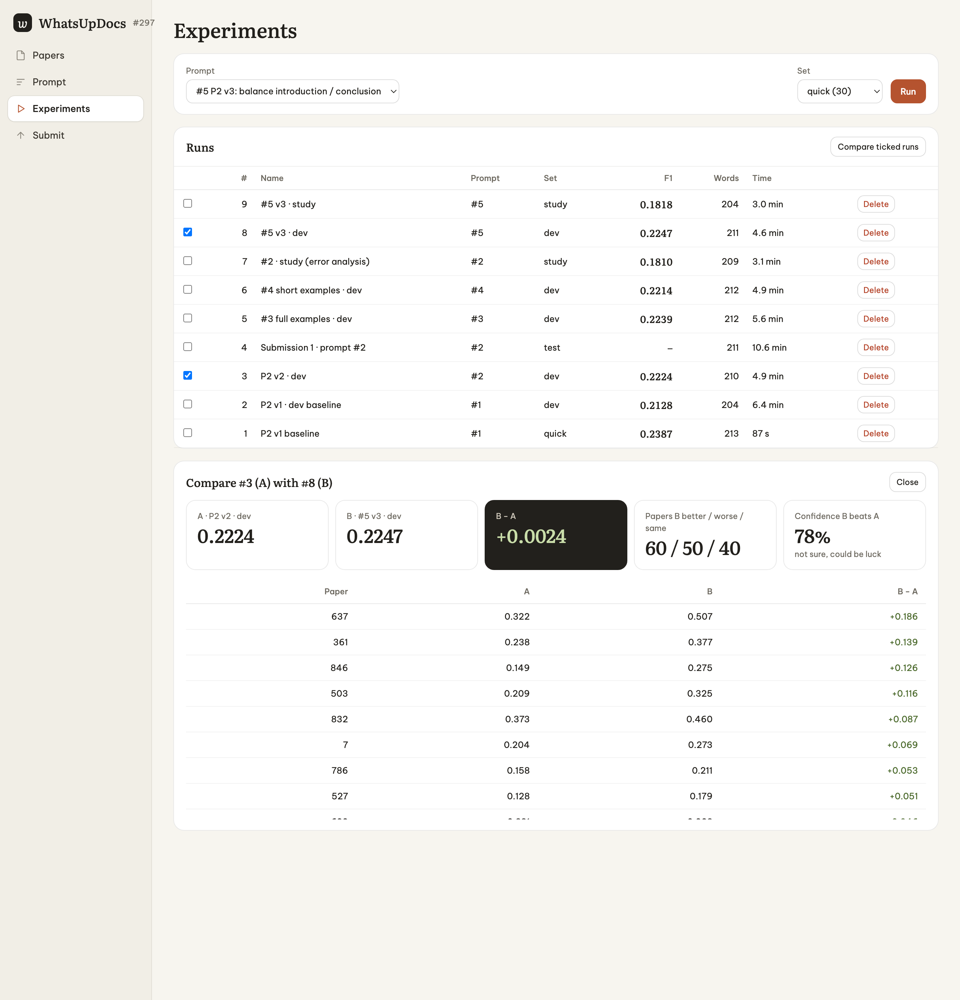
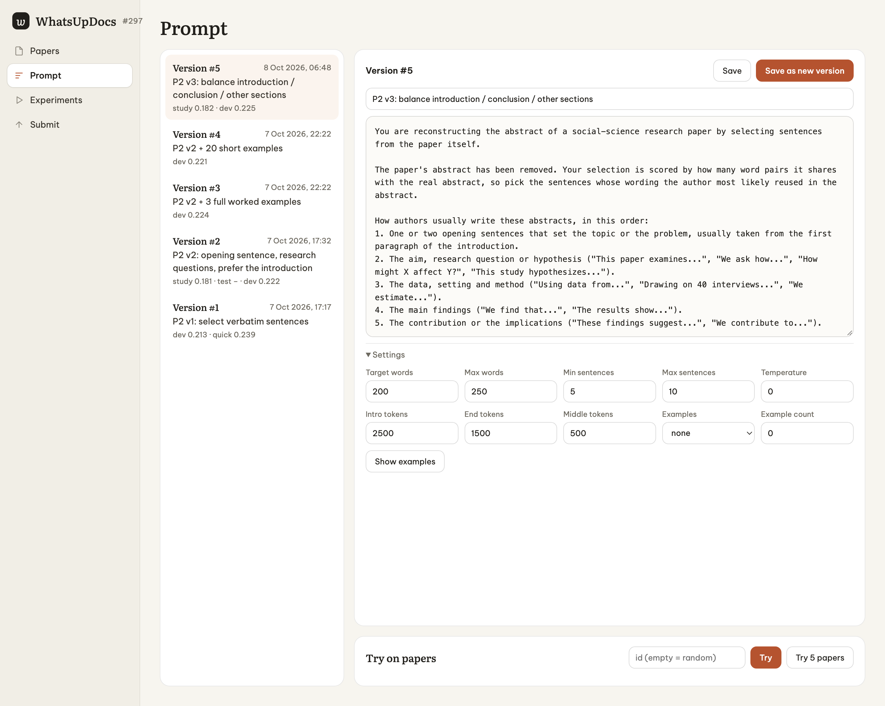
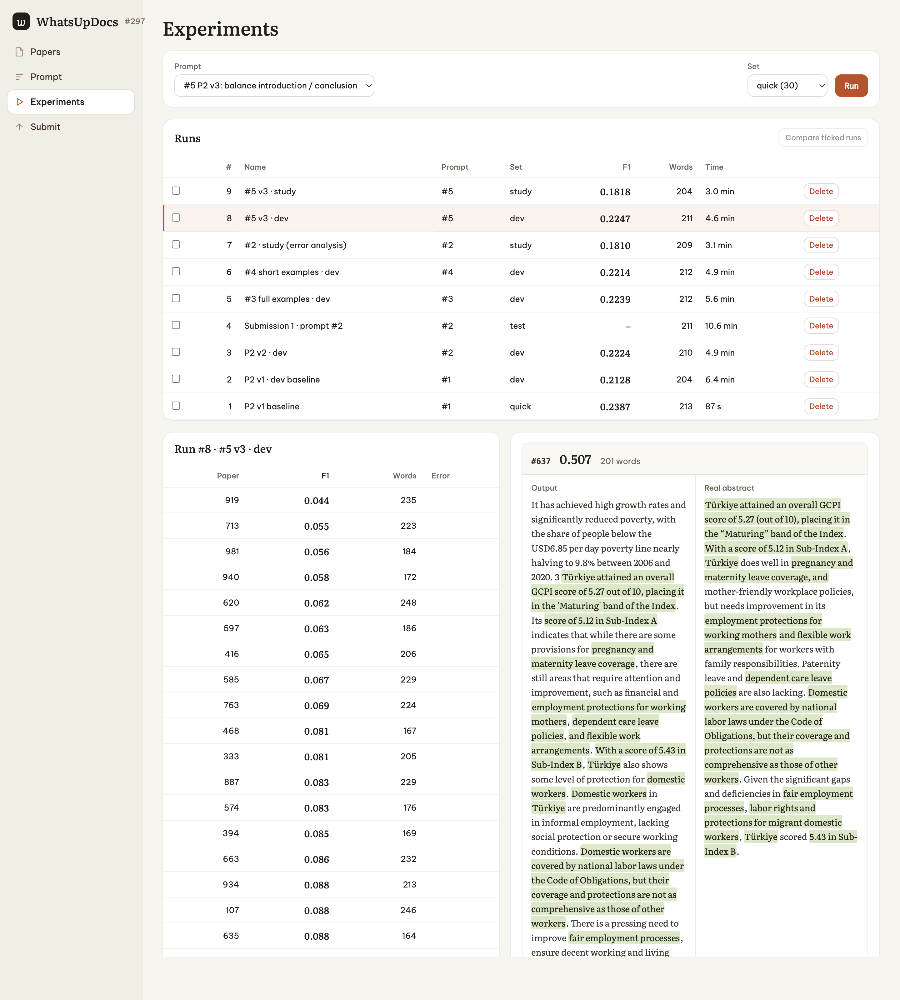
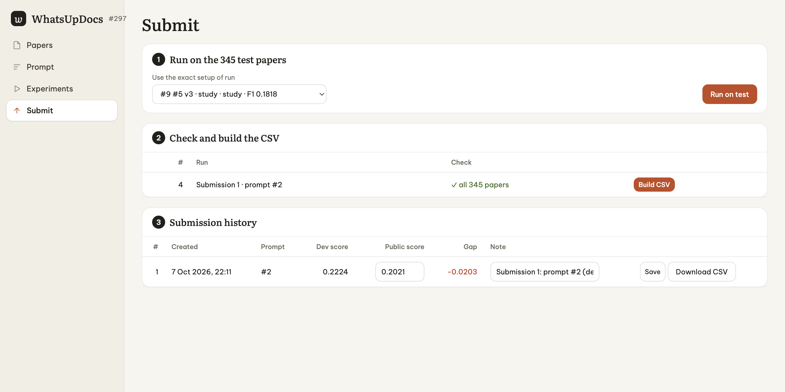

# WhatsUpDocs

An LLM workbench for the DrivenData competition [What's Up, Docs? (#297)](https://www.drivendata.org/competitions/297/whats-up-docs/): write the missing abstract of a social-science paper.

**Public score: 0.2021** ROUGE-2 F1. For comparison, the official benchmark scores 0.0781. On 2026-10-07 the second-highest entry on the public leaderboard was 0.1800.



## The problem

- **Input.** 1,000 training papers and 345 test papers from [SocArXiv](https://osf.io/preprints/socarxiv), as Markdown text. The abstract has been removed from each paper.
- **Output.** One paragraph: the paper's abstract.
- **Score.** The mean, per paper, of **ROUGE-2 F1** against the real abstract. ROUGE-2 counts the word pairs (bigrams) that the output shares with the real abstract.

So the metric does not care about good writing. It rewards **reusing the author's exact word pairs**.

## Key insight: authors copy themselves

Exploring the data ([docs/02-eda.md](docs/02-eda.md)) showed:

- 65% of papers share at least one **8-word span, word for word**, with their abstract.
- Authors build abstracts from their own sentences: the aim, the data, the main finding, the implication. They take these mostly from the introduction and the conclusion.
- Rewriting those sentences in other words loses bigrams, and therefore points.

| Approach (train set) | ROUGE-2 F1 |
|---|---|
| Official benchmark (Gemma 3 1B, abstractive) | 0.078 |
| First 400 tokens of the paper | 0.117 |
| Sentences with cue phrases ("this paper", "we find"…), no model | 0.135 |
| **Oracle**: greedy selection of the best sentences, knowing the real abstract | **0.350** |

Picking the right sentences has a high ceiling. Writing new text does not. So the system does **not** let the LLM write: the LLM only **chooses sentences**.

## Approach



1. **Clean.** Strip citations, tables, captions and HTML entities from the paper. Keep section headings.
2. **Context.** Long papers are cut to the parts where abstract wording lives. The prompt gets the beginning, the cue sentences from the middle, and the conclusion section. Short papers go in whole.
3. **Select, don't write.** Every sentence gets a number. The prompt explains how authors compose abstracts and asks for 5–10 sentence numbers, most important first.
4. **Assemble.** The app copies those sentences **verbatim**, keeps them in paper order, and stops at 250 words. The LLM never paraphrases.

The LLM is `gemini-3.8-flash-high`. It is called through [Microsoft Agent Framework](https://github.com/microsoft/agent-framework) (`Microsoft.Agents.AI.OpenAI`) and an OpenAI-compatible endpoint ([CLIProxyAPI](https://github.com/router-for-me/CLIProxyAPI)).

## Measuring honestly

The prompt is the main lever, so most of the work went into measuring prompt changes reliably:

- **Exact metric.** [Rouge2.cs](WhatsUpDocs/Rouge2.cs) is a C# port of the official scorer (google `rouge_score`, no stemming). A test checks it against the official Python code on 4,017 pairs, and checks the tokenizer on the whole corpus. Everything matches exactly.
- **Fixed splits.** Training papers are sorted by a SHA-256 hash of their id. The splits never change: `quick` 30 ⊂ `dev` 150, `holdout` 100, and `pool` 750 (few-shot examples come only from here). A separate `study` set of 100 pool papers is used to find errors, so `dev` stays clean for measuring.
- **Paired comparison.** Two runs are compared on the same papers, with a bootstrap "confidence that B beats A".
- **Calibration.** The `dev` split turned out easier than the test set: dev 0.2224 vs public 0.2021, a gap of −0.020.
- **Diagnostics.** For each run the app computes the ceiling (oracle on the context the model saw, and on the whole paper). It also tracks how much of the abstract's bigrams survive each step: paper → context → output.



## Results

| Version | What changed | dev 150 | Note |
|---|---|---|---|
| Prompt #1 | Select sentences, verbatim | 0.2128 | |
| Prompt #2 | Abstract recipe (opening sentence, question, data, findings, implications); prefer the introduction | 0.2224 | **Submitted: public 0.2021** |
| Prompt #3 | #2 + 3 full worked examples from `pool` | 0.2239 | Not a clear gain |
| Prompt #4 | #2 + 20 short examples (reused vs not reused sentences) | 0.2214 | No gain |
| Voting | Majority vote over 3 runs, no extra LLM calls | 0.2242 | Runs agree on ~75% of picks, so voting adds little |
| Prompt #5 | Balance where sentences come from (see below) | 0.2247 | 79% confidence of beating #2 |

**Where the points are lost.** On dev, the oracle reaches 0.360 using only the context the model saw, while the model reaches 0.22. So almost all of the gap is **sentence selection**, not context: the oracle on the whole paper only adds +0.024.

**Error study** (the `study` set, [src/study_errors.py](src/study_errors.py)):

| Where the picked sentences sit | Oracle | Prompt #1 | Prompt #2 |
|---|---|---|---|
| Introduction | 31–33% | 32% | **43–48%** |
| Conclusion / discussion | 25–26% | **38%** | 28% |
| Other sections | 21% | 14% | 13% |

Prompt #1 leaned on the conclusion. Prompt #2 overcorrected towards the introduction. Both under-use the other sections. Prompt #5 rebalances: the introduction share drops to 36–37%, but other sections stay at 14%. Each prompt tweak like this is now worth only about +0.002.

**Ideas not tried yet:**
- a stronger model for the selection step;
- scoring every sentence and letting the app pick by score and length;
- predicting the abstract length per paper.

## The app

An ASP.NET Core minimal API with a vanilla HTML/JS front end and SQLite (Dapper). It has four tabs.

**Prompt.** Edit a prompt, try it on a few papers right away, and save it as a version. Each version keeps its settings: word budget, number of sentences, context token budgets, and few-shot examples.



**Experiments.** Run a prompt version on a split. Progress streams live over SSE. You can then:
- sort papers by score and open any of them, to see the output next to the real abstract with the shared bigrams highlighted;
- tick two runs to compare them.

Each run stores a snapshot of the exact prompt, settings and model it used. Editing a prompt later marks old runs as stale instead of silently changing what they mean.



**Papers.** Answers "why did this paper score low?". For each paper it lists the sentences closest to the real abstract and labels each one:
- *picked*: the model chose it;
- *skipped by model*: it was in the context but the model did not choose it, so the prompt needs fixing;
- *not in context*: it was cut out, so the context builder needs fixing.

The cards at the top show the same diagnosis for the whole run.

**Submit.** Three steps:
1. Re-run the exact snapshot of a dev run on the 345 test papers.
2. Check the run (all ids present, no errors) and build the CSV.
3. After uploading to DrivenData, record the public score next to the dev score.



Any view can be opened directly by URL, for example `#docs?run=8&paper=637`, `#runs?compare=3,8` or `#prompts?settings`.

## Repository layout

```
WhatsUpDocs/            ASP.NET Core app (port 5090)
  Rouge2.cs             exact port of the official ROUGE-2
  TextClean.cs          cleaning, sentence and section splitting
  ContextBuilder.cs     intro / middle cue sentences / conclusion, numbered
  Prompts.cs            prompt versions + settings, default prompt
  Summarizer.cs         render prompt → LLM → parse numbers → assemble verbatim
  Llm.cs                Microsoft Agent Framework client
  Runs.cs               runs, snapshots, retry, compare
  Diagnostics.cs        oracle ceilings and bigram coverage
  FewShot.cs            example selection from the pool split
  Submissions.cs        CSV checks and export
  wwwroot/              UI
WhatsUpDocs.Tests/      xUnit tests (53), incl. metric parity with the official scorer
src/                    Python research scripts (baselines, fixtures, error analysis)
docs/                   research and EDA notes (in Vietnamese), screenshots
```

## Running it

Requirements: .NET 8, Python 3.12, and an OpenAI-compatible endpoint.

1. Download `train.csv`, `test_features.csv` and `submission_format.csv` from the competition page into `data/`. The competition data is not included in this repository.
2. Copy `.env.example` to `.env` and fill in the endpoint, the key and the model.
3. Generate the test fixtures from the official scorer:

```bash
python -m venv .venv && .venv/bin/pip install -r requirements.txt
```

```bash
.venv/bin/python src/make_fixtures.py
```

4. Run the tests and start the app:

```bash
dotnet test WhatsUpDocs.sln
```

```bash
cd WhatsUpDocs && dotnet run --launch-profile http
```

Open http://localhost:5090. On first start the app imports the CSVs into `data/app.db`, creates the splits and seeds prompt #1.
